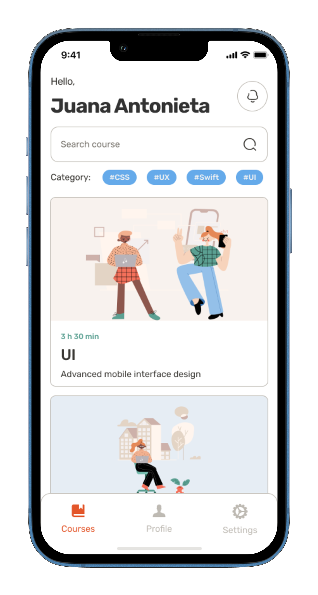

# edtech

 

This is an online education application for both Android and IOS. This application helps users in upgrading their skills through video lessons. It also helps users in keeping track of their progress through quiz on each topic they have completed.

## Flutter & Dart Version
-   Dart (2.17.5)
-   Flutter (3.0.4)

## Packages we are using:
-   smooth_page_indicator: [link](https://pub.dev/packages/smooth_page_indicator)
-   get: [link](https://pub.dev/packages/get)
-   flutter_gen: [link](https://pub.dev/packages/flutter_gen)

## Screens it contains:

=> Onboarding

=> Login

=> Sign Up

=> Courses

=> Profile

=> Settings

=> Course details

=> Course lessons

=> Course tests

=> Result screen

=> Payment Screen

=> Bottom Navigation Bar

## Screenshots
 
 

## Folder Structure

Let's take a deep dive to how the files and folders are arranged in the app.

 ```                    
|── edTech                       <------ Project
│   ├── android                         <------ Android config                
│   ├── ios                             <------ iOS config
│   ├── lib
│   │   └── assets                      <------ Assets used in the app
|   |          └── images               <------ Images Used in the Applications
│   │   └── screens                     <------ screens used in the App
│   │   └── utility                     <------ files containing all constants and strings u
│   │   └── widgets                     <------ Assets used in the app
|   |          └── screen-sub-folders   <------ Contains widgets of the every screen used in the app       
│   │   └── main.dart                   <------ Starting point of the app
│   ├── pubspec.yaml                    <------ Contains dependencies used in the app
│
│   ├── .....
```
